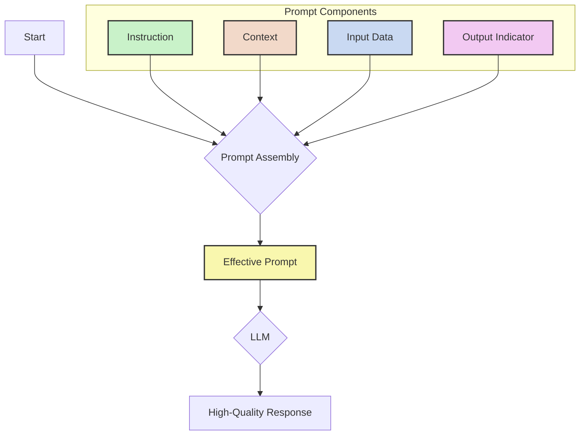

# The Anatomy of an Effective AI Prompt

A well-structured prompt is the key to unlocking high-quality, relevant, and predictable responses from large language models. While a simple question can work, crafting a detailed prompt significantly improves performance by giving the model the necessary guardrails and information to succeed.

An effective prompt is a composite of several distinct elements that work together. Understanding these parts allows you to engineer your prompts for precision and control.

---
## Visualizing the Prompt Structure

These four components come together to form a complete, well-defined request. The following diagram illustrates how they are structured to build a final prompt.

## The Four Core Components of a Prompt

A robust prompt can be broken down into four primary elements: Instruction, Context, Input Data, and Output Indicator. While not every prompt requires all four, combining them is the best way to ensure the model understands your exact needs.

### 1. Instruction
**What it is:** The `Instruction` is a clear, direct command that tells the model what task to perform. It's the primary verb of your request.

**Why it matters:** This is the most critical part of the prompt. An ambiguous or missing instruction forces the model to guess your intent, often leading to generic or incorrect responses.

**Examples:**
- "Summarize the following text."
- "Translate this sentence into French."
- "Write a Python function that calculates the factorial of a number."
- "Classify the sentiment of the user review below as positive, negative, or neutral."

### 2. Context
**What it is:** `Context` provides the model with external information, background, or constraints it should consider when performing the instruction. It sets the scene and provides necessary knowledge that the model might not have internally.

**Why it matters:** Context helps steer the model toward a more nuanced and accurate response. It reduces ambiguity and can prevent the model from making incorrect assumptions or "hallucinating" facts. For the ScaleDown API, the `context` field is where you would place this information for targeted compression.

**Examples:**
- "You are a helpful assistant for a financial services company. Your tone should be professional and encouraging." (Providing a persona)
- "The user is a beginner at programming, so explain the concepts simply." (Defining the audience)
- "Here is the article to be summarized: [long article text]..." (Supplying the source material)

### 3. Input Data
**What it is:** The `Input Data` is the specific piece of information that the model needs to act upon. It's the "subject" of your instruction's "verb."

**Why it matters:** This is the content you actually want the model to process. Without it, the instruction has nothing to work with. In the ScaleDown API, this corresponds to the `prompt` field.

**Examples:**
- "What is the capital of Nebraska?"
- `(Input for a function) n = 5`
- `(Text for translation) "Hello, how are you?"`

### 4. Output Indicator
**What it is:** The `Output Indicator` specifies the desired format, structure, or type of the response. It tells the model *how* to present its answer.

**Why it matters:** This component is crucial for programmatic use cases where a consistent output structure is required (e.g., JSON, Markdown, a simple list). It saves you post-processing steps and ensures the output is immediately usable.

**Examples:**
- "Provide the answer in JSON format with the keys 'capital' and 'state'."
- "Use bullet points for your summary."
- "Respond with only a single word."
- "Format the output as a Markdown table with two columns: 'Concept' and 'Explanation'."

---
