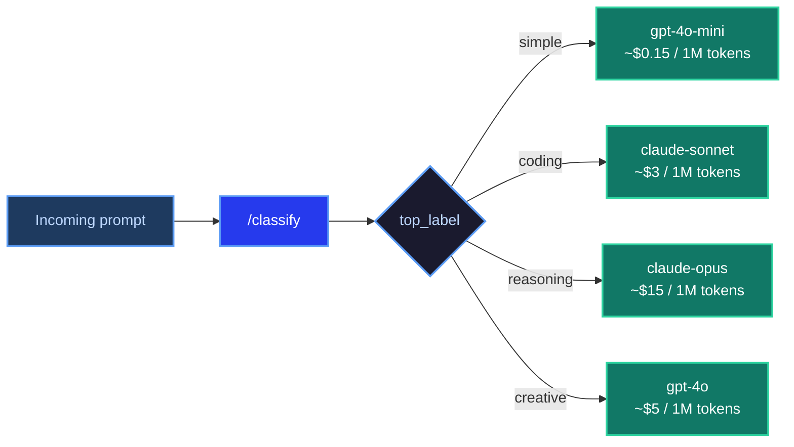

# Guide: LLM Model Routing

**ScaleDown Team** • April 2026 • 8 min read

Not every request needs your most expensive model. A simple factual lookup doesn't need GPT-4o. A one-line code fix doesn't need Claude Opus. But a complex multi-step reasoning problem probably does.

The `/classify` endpoint lets you inspect incoming requests and route them to the right model before you spend tokens on the wrong one. Define labels that describe task types, score each request against them, and dispatch to whichever model handles that task best.

<Tip>
This guide builds a **model router** that classifies incoming prompts by complexity and type, then dispatches each one to the appropriate LLM. The same pattern works with any set of models — swap in whatever providers and models fit your stack.
</Tip>

---

## The idea

Every LLM pipeline has a cost/capability tradeoff. Small, fast models are cheap but struggle with complex tasks. Large models handle anything but cost 10–50x more per token. Most pipelines send everything to the large model by default, leaving significant cost savings on the table.

A classifier lets you make that tradeoff explicit:



---

## Define your routing labels

The labels describe the kinds of tasks you want to route differently. Good routing labels are based on what the task *requires* — not what topic it's about.

```python
LABELS = [
    {
        "name": "simple",
        "rubric": (
            "Is this a simple, factual, or lookup request that requires a short "
            "direct answer with no complex reasoning or code?"
        )
    },
    {
        "name": "coding",
        "rubric": (
            "Does this request involve writing, reviewing, debugging, or explaining code?"
        )
    },
    {
        "name": "reasoning",
        "rubric": (
            "Does this request require multi-step reasoning, analysis, planning, "
            "or synthesising information from multiple sources?"
        )
    },
    {
        "name": "creative",
        "rubric": (
            "Is this a creative writing, brainstorming, or open-ended generative request "
            "where tone and style matter?"
        )
    },
]
```

Map each label to a model:

```python
MODEL_FOR_LABEL = {
    "simple":    "gpt-4o-mini",
    "coding":    "claude-sonnet-4-5",
    "reasoning": "claude-opus-4-6",
    "creative":  "gpt-4o",
}
```

---

## Build the router

<Steps>
  <Step title="Classify the prompt">
    ```python
    import requests

    CLASSIFY_URL = "https://api.scaledown.xyz/classify"
    SCALEDOWN_HEADERS = {
        "x-api-key": "YOUR_SCALEDOWN_API_KEY",
        "Content-Type": "application/json"
    }

    def pick_model(prompt: str) -> tuple[str, float]:
        """Return (model_id, confidence) for a given prompt."""
        response = requests.post(
            CLASSIFY_URL,
            headers=SCALEDOWN_HEADERS,
            json={"text": prompt, "labels": LABELS}
        )
        response.raise_for_status()
        result = response.json()

        label = result["top_label"]
        score = result["scores"][label]
        model = MODEL_FOR_LABEL[label]
        return model, score
    ```
  </Step>

  <Step title="Dispatch to the chosen model">
    ```python
    import anthropic
    from openai import OpenAI

    openai_client = OpenAI()
    anthropic_client = anthropic.Anthropic()

    def call_model(model: str, prompt: str) -> str:
        if model.startswith("claude"):
            message = anthropic_client.messages.create(
                model=model,
                max_tokens=1024,
                messages=[{"role": "user", "content": prompt}]
            )
            return message.content[0].text
        else:
            response = openai_client.chat.completions.create(
                model=model,
                messages=[{"role": "user", "content": prompt}]
            )
            return response.choices[0].message.content
    ```
  </Step>

  <Step title="Wire them together">
    ```python
    CONFIDENCE_THRESHOLD = 0.55

    def route_and_call(prompt: str) -> dict:
        model, confidence = pick_model(prompt)

        # Fall back to the capable default if the classifier is uncertain
        if confidence < CONFIDENCE_THRESHOLD:
            model = "gpt-4o"

        response = call_model(model, prompt)
        return {
            "model_used": model,
            "confidence": confidence,
            "response": response,
        }
    ```
  </Step>
</Steps>

---

## Full working example

<Tabs>
  <Tab title="Python" icon="python">
    ```python
    import requests
    import anthropic
    from openai import OpenAI

    CLASSIFY_URL = "https://api.scaledown.xyz/classify"
    SCALEDOWN_HEADERS = {
        "x-api-key": "YOUR_SCALEDOWN_API_KEY",
        "Content-Type": "application/json"
    }
    CONFIDENCE_THRESHOLD = 0.55

    LABELS = [
        {"name": "simple",    "rubric": "Is this a simple, factual, or lookup request that requires a short direct answer with no complex reasoning or code?"},
        {"name": "coding",    "rubric": "Does this request involve writing, reviewing, debugging, or explaining code?"},
        {"name": "reasoning", "rubric": "Does this request require multi-step reasoning, analysis, planning, or synthesising information from multiple sources?"},
        {"name": "creative",  "rubric": "Is this a creative writing, brainstorming, or open-ended generative request where tone and style matter?"},
    ]

    MODEL_FOR_LABEL = {
        "simple":    "gpt-4o-mini",
        "coding":    "claude-sonnet-4-5",
        "reasoning": "claude-opus-4-6",
        "creative":  "gpt-4o",
    }

    openai_client = OpenAI()
    anthropic_client = anthropic.Anthropic()

    def pick_model(prompt: str) -> tuple[str, float]:
        response = requests.post(
            CLASSIFY_URL,
            headers=SCALEDOWN_HEADERS,
            json={"text": prompt, "labels": LABELS}
        )
        response.raise_for_status()
        result = response.json()
        label = result["top_label"]
        score = result["scores"][label]
        return MODEL_FOR_LABEL[label], score

    def call_model(model: str, prompt: str) -> str:
        if model.startswith("claude"):
            msg = anthropic_client.messages.create(
                model=model,
                max_tokens=1024,
                messages=[{"role": "user", "content": prompt}]
            )
            return msg.content[0].text
        else:
            resp = openai_client.chat.completions.create(
                model=model,
                messages=[{"role": "user", "content": prompt}]
            )
            return resp.choices[0].message.content

    def route_and_call(prompt: str) -> dict:
        model, confidence = pick_model(prompt)
        if confidence < CONFIDENCE_THRESHOLD:
            model = "gpt-4o"
        return {
            "model_used": model,
            "confidence": round(confidence, 3),
            "response": call_model(model, prompt),
        }


    # Test across task types
    prompts = [
        "What is the capital of Japan?",
        "Write a Python function that finds all prime numbers up to n using the Sieve of Eratosthenes.",
        "A company has three products with different margin profiles. Walk me through how to decide which to prioritise for a sales push.",
        "Write a short poem about the feeling of debugging code at 2am.",
    ]

    for prompt in prompts:
        result = route_and_call(prompt)
        print(f"Prompt:     {prompt[:70]!r}")
        print(f"Model used: {result['model_used']} (confidence: {result['confidence']})")
        print()
    ```

    **Output:**

    ```
    Prompt:     'What is the capital of Japan?'
    Model used: gpt-4o-mini (confidence: 0.923)

    Prompt:     'Write a Python function that finds all prime numbers up to n using'
    Model used: claude-sonnet-4-5 (confidence: 0.881)

    Prompt:     'A company has three products with different margin profiles. Walk me'
    Model used: claude-opus-4-6 (confidence: 0.864)

    Prompt:     'Write a short poem about the feeling of debugging code at 2am.'
    Model used: gpt-4o (confidence: 0.791)
    ```
  </Tab>
</Tabs>

---

## Cost impact

The savings depend on your traffic mix, but routing even 40% of requests to a cheaper model has a large effect at scale.

| Scenario | Without routing | With routing |
|---|---|---|
| 1M requests/day, all to `claude-opus` | ~$15,000/day | — |
| 50% simple, 30% coding, 20% reasoning | ~$15,000/day | ~$4,800/day |
| Savings | — | **~68%** |

The classify call itself adds a small latency cost (typically 50–150ms) and a negligible token cost — far less than the savings from routing simple requests away from expensive models.

---

## Tips for production

<CardGroup cols={2}>
  <Card title="Start with two tiers" icon="layer-group">
    A simple `fast` / `powerful` split is easier to tune than four labels. Add more tiers once you have data on where the boundaries actually fall in your traffic.
  </Card>
  <Card title="Log every routing decision" icon="chart-line">
    Store `prompt`, `top_label`, `scores`, and `model_used` for every request. After a week you'll see exactly where the classifier is uncertain and whether those requests actually needed a more powerful model.
  </Card>
  <Card title="Set a sensible fallback" icon="shield-halved">
    When confidence is low, fall back to a capable middle-tier model rather than the cheapest or the most expensive. Uncertain inputs rarely need your best model, but they do need something reliable.
  </Card>
  <Card title="Overlap is a signal, not a bug" icon="magnifying-glass">
    If `coding` and `reasoning` frequently score close together, that's telling you something about your traffic — complex coding tasks genuinely sit at the boundary. Consider merging them or adding a dedicated label.
  </Card>
</CardGroup>
