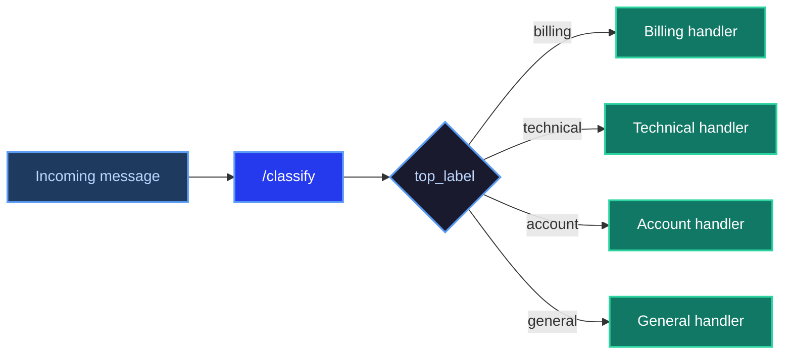

# Guide: Support Ticket Classification

**ScaleDown Team** • April 2026 • 8 min read

Most AI pipelines aren't one-size-fits-all. A customer support system needs different logic for billing questions versus technical bugs. A document processor needs different prompts for legal contracts versus financial reports. Hard-coded keyword rules break down fast. Fine-tuning a classifier requires labelled data you may not have.

The `/classify` endpoint gives you a probability distribution over labels you define in plain language. Use it as the first step in your pipeline to decide which branch to take — no training data, no model fine-tuning, no rules engine.

<Tip>
This guide builds a **support ticket router** that classifies incoming messages and dispatches them to the appropriate handler. The same pattern works for document routing, intent detection, content moderation, and more.
</Tip>

---

## How routing with classify works



The key insight: instead of writing routing logic, you write **rubrics** — yes/no questions that describe each category. The model scores the input text against each rubric and returns a probability distribution. You read `top_label` and route accordingly.

---

## Define your labels

The rubric is what makes routing accurate. Each rubric is a yes/no question phrased so that "yes" means the label applies. Specific, independent rubrics produce clean separation between categories.

```python
LABELS = [
    {
        "name": "billing",
        "rubric": "Is this text about a billing issue, charge, refund, or payment problem?"
    },
    {
        "name": "technical",
        "rubric": "Is this text about a technical problem, bug, or product not working correctly?"
    },
    {
        "name": "account",
        "rubric": "Is this text about account access, login, password, or account settings?"
    },
    {
        "name": "general",
        "rubric": "Is this a general question or inquiry that does not fit a specific support category?"
    }
]
```

<Info>
Keep rubrics independent. "Is this about a billing issue?" and "Is this about a payment problem?" overlap — they'll split probability mass between two labels for the same input. Merge them into one rubric or one label.
</Info>

---

## Build the router

<Steps>
  <Step title="Set up your client">
    ```python
    import requests

    CLASSIFY_URL = "https://api.scaledown.xyz/classify"
    HEADERS = {
        "x-api-key": "YOUR_SCALEDOWN_API_KEY",
        "Content-Type": "application/json"
    }
    ```
  </Step>

  <Step title="Call /classify">
    ```python
    def classify_ticket(text: str) -> dict:
        response = requests.post(
            CLASSIFY_URL,
            headers=HEADERS,
            json={"text": text, "labels": LABELS}
        )
        response.raise_for_status()
        return response.json()

    ticket = "I was charged twice for my subscription this month and need a refund."
    result = classify_ticket(ticket)

    print(result["top_label"])   # "billing"
    print(result["scores"])      # {"billing": 0.921, "technical": 0.034, ...}
    ```
  </Step>

  <Step title="Route on top_label">
    ```python
    def handle_billing(text: str) -> str:
        return f"[Billing] Escalated to billing team: {text}"

    def handle_technical(text: str) -> str:
        return f"[Technical] Opened bug report: {text}"

    def handle_account(text: str) -> str:
        return f"[Account] Sent to account support: {text}"

    def handle_general(text: str) -> str:
        return f"[General] Added to general queue: {text}"

    HANDLERS = {
        "billing": handle_billing,
        "technical": handle_technical,
        "account": handle_account,
        "general": handle_general,
    }

    def route(text: str) -> str:
        result = classify_ticket(text)
        label = result["top_label"]
        return HANDLERS[label](text)

    print(route("I was charged twice for my subscription this month."))
    # [Billing] Escalated to billing team: I was charged twice...
    ```
  </Step>

  <Step title="Add a confidence threshold">
    The classifier always returns a winner. If you only want to act when the model is confident, check the top score before routing.

    ```python
    CONFIDENCE_THRESHOLD = 0.6

    def route_with_threshold(text: str) -> str:
        result = classify_ticket(text)
        label = result["top_label"]
        score = result["scores"][label]

        if score < CONFIDENCE_THRESHOLD:
            return f"[Unrouted] Low confidence ({score:.2f}) — sent to manual review"

        return HANDLERS[label](text)

    print(route_with_threshold("Can you help me?"))
    # [Unrouted] Low confidence (0.38) — sent to manual review
    ```

    <Info>
    A low top score usually means the message is ambiguous or doesn't fit any label well. Routing these to a human or a fallback handler is often the right call.
    </Info>
  </Step>
</Steps>

---

## Full working example

<Tabs>
  <Tab title="Python" icon="python">
    ```python
    import requests

    CLASSIFY_URL = "https://api.scaledown.xyz/classify"
    HEADERS = {
        "x-api-key": "YOUR_SCALEDOWN_API_KEY",
        "Content-Type": "application/json"
    }
    CONFIDENCE_THRESHOLD = 0.6

    LABELS = [
        {"name": "billing",   "rubric": "Is this text about a billing issue, charge, refund, or payment problem?"},
        {"name": "technical", "rubric": "Is this text about a technical problem, bug, or product not working correctly?"},
        {"name": "account",   "rubric": "Is this text about account access, login, password, or account settings?"},
        {"name": "general",   "rubric": "Is this a general question or inquiry that does not fit a specific support category?"},
    ]

    def classify_ticket(text: str) -> dict:
        response = requests.post(
            CLASSIFY_URL,
            headers=HEADERS,
            json={"text": text, "labels": LABELS}
        )
        response.raise_for_status()
        return response.json()

    def route(text: str) -> dict:
        result = classify_ticket(text)
        label = result["top_label"]
        score = result["scores"][label]

        if score < CONFIDENCE_THRESHOLD:
            return {"routed": False, "reason": "low_confidence", "scores": result["scores"]}

        return {"routed": True, "label": label, "score": score}


    # Test cases
    tickets = [
        "I was charged twice for my subscription this month and need a refund.",
        "The dashboard keeps throwing a 500 error when I try to export my data.",
        "I can't log in — I think I forgot my password.",
        "Can you help me?",
    ]

    for ticket in tickets:
        outcome = route(ticket)
        print(f"{ticket[:60]!r}")
        print(f"  → {outcome}\n")
    ```

    **Output:**

    ```
    'I was charged twice for my subscription this month and need'
      → {'routed': True, 'label': 'billing', 'score': 0.921}

    'The dashboard keeps throwing a 500 error when I try to exp'
      → {'routed': True, 'label': 'technical', 'score': 0.887}

    "I can't log in — I think I forgot my password."
      → {'routed': True, 'label': 'account', 'score': 0.934}

    'Can you help me?'
      → {'routed': False, 'reason': 'low_confidence', 'scores': {'billing': 0.27, 'technical': 0.24, 'account': 0.26, 'general': 0.23}}
    ```
  </Tab>
</Tabs>

---

## Using scores for more than routing

`top_label` is the simplest way to route, but the full `scores` map gives you more options.

**Escalate when two labels are close.** If `billing` and `technical` are both above 0.3, the ticket might need both teams.

```python
def needs_escalation(scores: dict, threshold: float = 0.3) -> bool:
    high_scoring = [label for label, score in scores.items() if score > threshold]
    return len(high_scoring) > 1
```

**Log confidence over time.** Consistently low top scores on a particular label signal a rubric that isn't specific enough — or a new category you haven't defined yet.

**Soft routing for LLM prompts.** Instead of hard-switching handlers, use the top label to choose a system prompt:

```python
SYSTEM_PROMPTS = {
    "billing":   "You are a billing support specialist. Focus on charges, refunds, and payment issues.",
    "technical": "You are a technical support engineer. Focus on bugs, errors, and product behaviour.",
    "account":   "You are an account support specialist. Focus on access, credentials, and settings.",
    "general":   "You are a helpful support agent. Answer the customer's question clearly and concisely.",
}

def get_system_prompt(text: str) -> str:
    result = classify_ticket(text)
    return SYSTEM_PROMPTS[result["top_label"]]
```

---

## Tips for production

<CardGroup cols={2}>
  <Card title="Start with few labels" icon="layer-group">
    Four to six well-defined labels outperform ten overlapping ones. Add labels only when you see a real category of traffic that isn't being routed correctly.
  </Card>
  <Card title="Tune thresholds on real data" icon="sliders">
    The right confidence threshold depends on your traffic. Log `top_label` and `score` for a week, then look at the score distribution to find a natural cutoff.
  </Card>
  <Card title="Test rubrics before deploying" icon="flask">
    Run a sample of real messages through your labels before going live. If two labels consistently score within 0.05 of each other, your rubrics are too similar — merge or rewrite them.
  </Card>
  <Card title="Handle the fallback" icon="shield-halved">
    Always have a fallback path for low-confidence or unrecognised inputs. Routing uncertain messages to a human or a general-purpose handler is better than forcing a wrong label.
  </Card>
</CardGroup>
