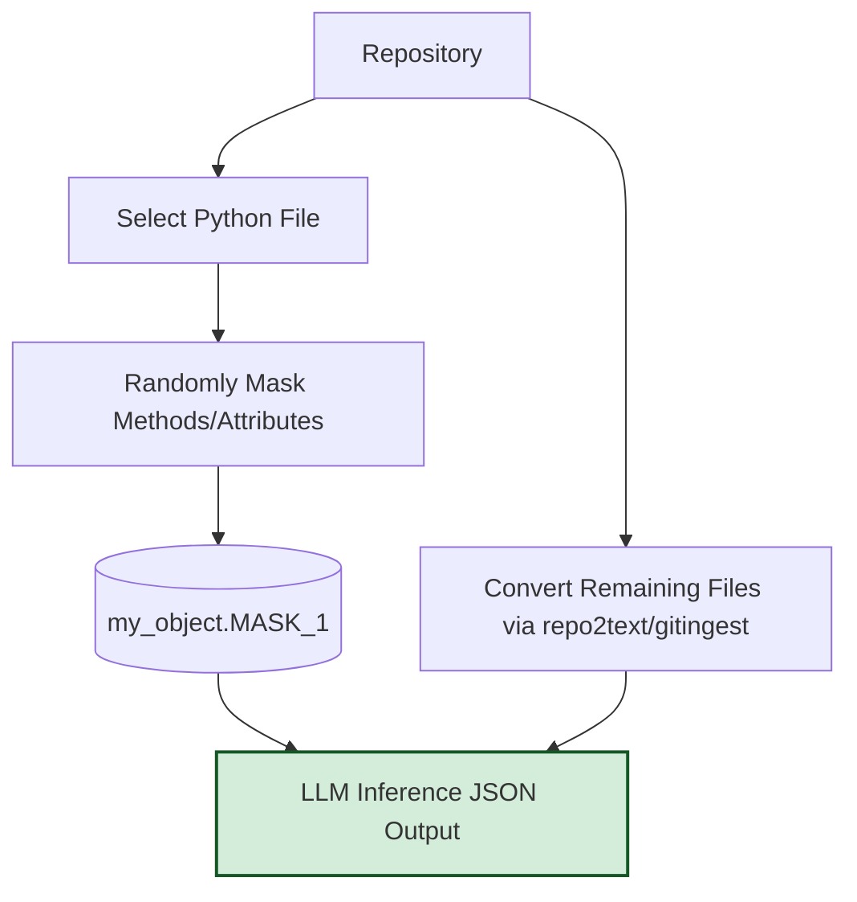

# Overview

A brief summary of the project: a dataset and evaluation framework for studying how code compression interacts with hallucinations in LLMs. The approach uses AST-based chunking and a masking task to test how additional context affects inference quality, with the goal of preserving semantic meaning while reducing unnecessary context.

## Introduction

Large language models degrade in accuracy when given very long code repositories, a phenomenon we refer to as **context rot**. We hypothesize that compressing code context can mitigate that degradation, or at least slow it relative to the compression rate. 

We hypothesize that code can be compressed more effectively by breaking it into **AST-based chunks** rather than applying naïve token-level truncation.

---

## Dataset Construction

Off-the-shelf datasets were not suitable for this task:
- Popular datasets like **MBPP** and **HumanEval** are limited to short snippets without long context.
- Defining a **Hallucination measurement** is non-trivial
   - **Functional correctness** provided a sparse signal and was hard to design compression experiments for
   - **Repositories** lacked labels or consistent test coverage to be standardized by our small team.

To address this, we built a dataset using a semi-supervised **masking task** to assign labels to real repositories.

---

## Masking Task

The masking task is defined as follows:
- **Selection:** Choose a Python file from a repository.  
- **Masking:** Randomly replace methods or attributes with identifiers such as `MASK_1`.  
- **Context:** Provide the rest of the repository as plain text (via `repo2text` or `gitingest`).  
- **Inference:** Ask the LLM to fill in the masked elements, returning a JSON mapping.  

We can compare the model's response to the original strings. This task measures the model’s ability to **infer missing APIs** from surrounding context and additional repository context.

---

## Evaluating Accuracy

Not all masks are equally useful:
- Some are **uninformative** (no signal exists in the repo).  
- Some are **trivial** (common APIs likely memorized during pretraining).  

To control for this, we focus on **relative performance**:
- Compare masked-file accuracy with and without repository context.  
- Run experiments across different compression levels (0% to 100%).  
- Analyze the **distribution** of results, not only raw accuracy.  

This approach reduces noise from mask difficulty and memorization effects.

---

## Compression Methods

To determine which code chunks to retain under compression, we explored two relevance-scoring methods:

1. **N-gram Similarity**  
   - Compute n-gram overlap between the masked file and other AST chunks.  
   - Rank chunks by overlap score.  

2. **Embedding Cosine Similarity**  
   - Embed each chunk with a code embedding model.  
   - Compare cosine similarity between the masked file and other chunks.  
   - Select high-similarity chunks to keep in the compressed context.  

These methods provide a structured way to prune context while retaining the most relevant information.

---

## Summary

This framework provides a reproducible setup for studying hallucinations under code compression:
- **Dataset creation:** Semi-supervised masking task applied to real repositories.  
- **Evaluation signal:** Improvement from additional context, rather than absolute accuracy.  
- **Compression strategies:** AST chunking with similarity-based selection.  

Stay tuned for quantitative analysis of our experimental results.
