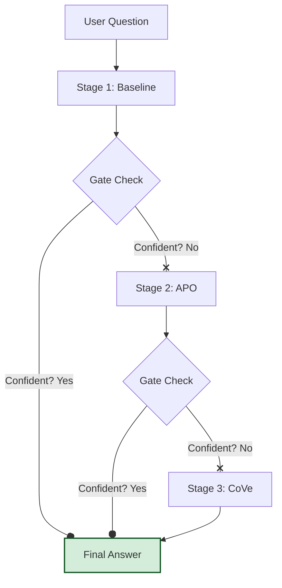

A brief summary of the pipeline: a multi-stage, configurable workflow designed to improve the factual accuracy and reduce hallucinations in LLM responses by applying techniques like prompt optimization, chain-of-verification, and confidence gatin

## Introduction
* Explain the problem: hallucinations and factual errors in LLMs.
* Position this pipeline as the next evolution of ScaleDown's mission—moving beyond optimizing the *input* (prompt) to orchestrating the entire *generation process*.

* ## Architectural Overview**
* This diagram illustrates the pipeline's flow, showing how a question passes through stages and gate checks, with the possibility of an early exit if an answer is deemed confident.

### **Model Roles**

The pipeline uses a multi-model architecture where different models act as specialized agents to improve efficiency and quality.

* **Target Model:** This is the primary, often most powerful, model responsible for generating the main answer to the user's question.
* **Helper Model:** A smaller, faster, and more cost-effective model used for auxiliary tasks like rewriting prompts (in the APO stage) or generating verification questions (in the CoVe stage).
* **Judge Model:** A model used exclusively by the `JudgeGate` to evaluate the confidence or correctness of an answer, deciding whether the pipeline can exit early or must proceed to the next stage.

---

### **4. Key Components of the Pipeline**

#### **4.1. Composable Stages**

A "stage" is a distinct, self-contained step in the pipeline that performs a specific operation on the user's question or a previous answer. The pipeline is built by chaining these stages together in a sequence.

* **Baseline:** The simplest stage. It directly asks the target model the initial question without any modification.
* **Automatic Prompt Optimization (APO):** This stage uses a helper model to rewrite the initial question into a more detailed and clearer prompt, which is then passed to the target model.
* **Chain-of-Verification (CoVe):** This stage improves the factual accuracy of an answer by having a helper model generate verification questions, answering them, and then producing a final, verified answer based on this new context.
* **Self-Correction:** An iterative stage where the target model is asked to critique and refine its own previous answer, improving its quality step-by-step.

#### **4.2. Intelligent Gating for Efficiency**

Gates are decision points between stages that determine whether the pipeline has produced a sufficiently high-quality answer to stop processing and return a result. Their main purpose is to save costs and reduce latency by avoiding unnecessary stages.

* **Oracle Gate:** A gate used for evaluation purposes only. It compares the model's answer to a known "ground truth" answer to check for correctness.
* **Judge Gate:** A gate designed for production use. It employs a separate "judge" LLM to programmatically assess the quality of the last answer and decide if it meets a predefined confidence threshold.

#### **4.3. Synergy with Token Compression**

The pipeline is designed to work seamlessly with ScaleDown's core compression technology. Each model role (`target`, `helper`, `judge`) can be individually wrapped with the `ScaleDownCompressionWrapper`. This means that every prompt generated at every stage is automatically compressed before being sent to an LLM, layering token savings on top of the workflow's logical efficiencies.

---

### **5. Example Workflow: A Question's Journey**

Let's trace a question through a `baseline -> apo -> cove` pipeline.

1.  **Initial State:**
    * **Question:** "What did the 2010 Frank Rosenblatt Award winner research?"
    * **Context (`ctx`):** `{'question': '...', 'last_answer': None}`

2.  **Stage 1: Baseline**
    * The `Baseline` stage sends the question directly to the **Target Model**.
    * **`ctx` is updated:** `{'last_answer': 'The winner researched neural networks.'}`

3.  **Gate Check (Not Confident)**
    * The `JudgeGate` determines the answer is too generic and lacks specifics. It decides to proceed.

4.  **Stage 2: Automatic Prompt Optimization (APO)**
    * The **Helper Model** rewrites the original question into: "Provide the specific research focus and key contributions of the person who won the IEEE Frank Rosenblatt Award in 2010."
    * This new, better prompt is sent to the **Target Model**.
    * **`ctx` is updated:** `{'last_answer': 'Geoffrey Hinton, winner of the 2010 award, researched deep learning and Boltzmann machines.'}`

5.  **Gate Check (Not Confident)**
    * The `JudgeGate` finds the answer better but wants factual verification. It decides to proceed.

6.  **Stage 3: Chain-of-Verification (CoVe)**
    * The **Helper Model** generates verification questions based on the last answer: `["Who won the 2010 Rosenblatt award?", "What are Boltzmann machines?"]`
    * The pipeline answers these questions.
    * The **Target Model** receives the original question plus the new verification context and produces a final, verified answer.
    * **`ctx` is updated:** `{'last_answer': 'The 2010 IEEE Frank Rosenblatt Award was given to Geoffrey Hinton for his foundational work on deep learning algorithms, specifically his co-invention of Boltzmann machines...'}`

7.  **Final Output:** The pipeline returns the final, verified `last_answer`.

---

### **6. Conclusion & Impact**

The Hallucination Reduction Pipeline provides a powerful, structured approach to enhancing LLM reliability.

* **Reduced Hallucinations:** Through explicit verification steps like CoVe, the model is forced to check its facts before finalizing an answer.
* **Higher Accuracy:** Iterative stages like APO and Self-Correction refine prompts and answers, leading to more precise and relevant results.
* **Cost Efficiency:** Intelligent gating prevents redundant processing, while integrated token compression lowers the cost of every LLM call.
* **Developer Control:** The modular, API-driven design allows developers to construct custom pipelines tailored to their specific needs for cost, speed, and accuracy.
