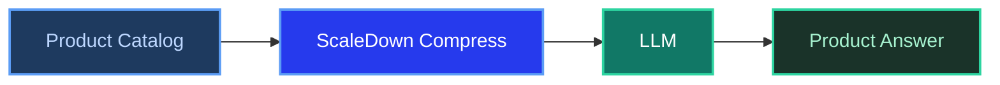

# RAG Example: E-commerce Product Assistant

**ScaleDown Team** • February 2025 • 10 min read

Online shoppers ask specific questions: *"Is this jacket waterproof?"*, *"Does this laptop have a USB-C port?"*, *"Which running shoes work for flat feet?"* A product assistant powered by RAG can answer these from your catalog data, and you don't need a vector database to build one.

With ScaleDown, you feed your product catalog as `context` and the shopper's question as `prompt`. ScaleDown compresses the catalog down to only the relevant product details before the LLM generates an answer.

<Tip>
This example builds a **product Q&A assistant** for an electronics store. It answers shopper questions from a product catalog using only ScaleDown and an LLM.
</Tip>

---

## The Problem

Product catalogs have hundreds of items, each with specs, descriptions, pricing, and availability. When a shopper asks about one product or feature, the LLM doesn't need to see every item in the catalog. Just the ones that match.



---

## The Product Catalog

Here's a sample electronics catalog with 6 products:

<Accordion title="Sample product catalog">
```python
product_catalog = """
## MacBook Pro 16" M3 Max
- Price: $3,499
- Processor: Apple M3 Max, 16-core CPU, 40-core GPU
- RAM: 48GB unified memory
- Storage: 1TB SSD
- Display: 16.2" Liquid Retina XDR, 3456x2234, 120Hz ProMotion
- Battery: Up to 22 hours
- Ports: 3x Thunderbolt 4 (USB-C), HDMI, SDXC, MagSafe 3, headphone jack
- Weight: 4.8 lbs
- Best for: Professional video editing, 3D rendering, software development

## Dell XPS 13 Plus
- Price: $1,299
- Processor: Intel Core Ultra 7 155H
- RAM: 16GB LPDDR5x
- Storage: 512GB SSD
- Display: 13.4" FHD+, 1920x1200, 60Hz, touch
- Battery: Up to 13 hours
- Ports: 2x Thunderbolt 4 (USB-C), no USB-A, no headphone jack
- Weight: 2.73 lbs
- Best for: Ultraportable daily driver, business travel

## Sony WH-1000XM5 Headphones
- Price: $349
- Type: Over-ear, wireless, noise-canceling
- Driver: 30mm carbon fiber composite
- Battery: 30 hours (ANC on), 40 hours (ANC off)
- Connectivity: Bluetooth 5.3, 3.5mm audio cable, USB-C charging
- ANC: Adaptive noise canceling with Auto NC Optimizer
- Weight: 8.8 oz
- Best for: Commuting, office work, frequent flyers

## Samsung Galaxy S24 Ultra
- Price: $1,299
- Processor: Snapdragon 8 Gen 3
- RAM: 12GB
- Storage: 256GB (expandable: no)
- Display: 6.8" Dynamic AMOLED 2X, 3120x1440, 120Hz
- Camera: 200MP main + 12MP ultrawide + 50MP 5x telephoto + 10MP 3x telephoto
- Battery: 5000mAh, 45W wired charging, 15W wireless
- S Pen: Included, built-in
- Best for: Photography, productivity, note-taking

## Apple AirPods Pro 2
- Price: $249
- Type: In-ear, wireless, noise-canceling
- Driver: Custom Apple H2 chip
- Battery: 6 hours (ANC on), 30 hours with case
- Connectivity: Bluetooth 5.3, USB-C charging case
- ANC: Active noise cancellation with Adaptive Transparency
- Features: Personalized Spatial Audio, conversation awareness, IP54 dust/water resistance
- Best for: iPhone users, workouts, daily commute

## LG C4 65" OLED TV
- Price: $1,799
- Display: 65" OLED evo, 3840x2160, 120Hz
- Processor: Alpha 9 Gen 7
- HDR: Dolby Vision, HDR10, HLG
- Audio: Dolby Atmos, 40W 2.2ch speakers
- Smart TV: webOS 24, built-in Alexa and Google Assistant
- Gaming: 4x HDMI 2.1, VRR, ALLM, G-Sync, FreeSync Premium
- Best for: Movie watching, console gaming, home theater
"""
```
</Accordion>

---

## Build the Product Assistant

<Steps>
  <Step title="Set up your clients">
    ```python
    import requests
    from openai import OpenAI

    SCALEDOWN_URL = "https://api.scaledown.xyz/compress/raw/"
    SCALEDOWN_HEADERS = {
        "x-api-key": "YOUR_SCALEDOWN_API_KEY",
        "Content-Type": "application/json"
    }
    openai_client = OpenAI()
    ```
  </Step>

  <Step title="Compress the catalog against the question">
    A shopper asks about USB-C ports. The catalog has 6 products. ScaleDown keeps only the ones with relevant port information.

    ```python
    shopper_question = "Which laptops have USB-C ports and how many?"

    response = requests.post(
        SCALEDOWN_URL,
        headers=SCALEDOWN_HEADERS,
        json={
            "context": product_catalog,
            "prompt": shopper_question,
            "model": "gpt-4o",
            "scaledown": {"rate": "auto"}
        }
    )

    result = response.json()
    compressed = result["compressed_prompt"]

    print(f"Original: {result['original_prompt_tokens']} tokens")
    print(f"Compressed: {result['compressed_prompt_tokens']} tokens")
    ```

    <Accordion title="What got compressed?">
    The catalog has 6 products. The shopper asked about **laptops with USB-C**. ScaleDown kept the MacBook Pro (3x Thunderbolt 4 USB-C) and Dell XPS 13 (2x Thunderbolt 4 USB-C) details while compressing away the headphones, phone, earbuds, and TV since none of those are laptops.
    </Accordion>
  </Step>

  <Step title="Generate the answer">
    ```python
    response = openai_client.chat.completions.create(
        model="gpt-4o",
        messages=[
            {
                "role": "system",
                "content": (
                    "You are a helpful electronics store assistant. "
                    "Answer the customer's question using ONLY the provided "
                    "product information. Be specific about specs and prices."
                )
            },
            {
                "role": "user",
                "content": f"Products:\n{compressed}\n\nQuestion: {shopper_question}"
            }
        ],
        temperature=0.2
    )

    print(response.choices[0].message.content)
    ```

    **Example output:**
    > We have two laptops with USB-C ports:
    > 1. **MacBook Pro 16" M3 Max** ($3,499) - 3x Thunderbolt 4 (USB-C) ports, plus HDMI, SDXC, and MagSafe
    > 2. **Dell XPS 13 Plus** ($1,299) - 2x Thunderbolt 4 (USB-C) ports (note: no USB-A or headphone jack)

    <Check>
    Specific port counts, accurate prices, and a useful note about the Dell's limited port selection. All grounded in the catalog data.
    </Check>
  </Step>
</Steps>

---

## Reusable Product Q&A Function

<Tabs>
  <Tab title="Python" icon="python">
    ```python
    def ask_product(catalog: str, question: str) -> str:
        """Answer a shopper's question from the product catalog."""

        # Compress: keeps relevant products, drops the rest
        compress_resp = requests.post(
            SCALEDOWN_URL,
            headers=SCALEDOWN_HEADERS,
            json={
                "context": catalog,
                "prompt": question,
                "model": "gpt-4o",
                "scaledown": {"rate": "auto"}
            }
        )
        compressed = compress_resp.json()["compressed_prompt"]

        # Generate
        ai_resp = openai_client.chat.completions.create(
            model="gpt-4o",
            messages=[
                {
                    "role": "system",
                    "content": (
                        "You are a helpful electronics store assistant. "
                        "Answer using ONLY the provided product information. "
                        "Include prices and key specs."
                    )
                },
                {
                    "role": "user",
                    "content": f"Products:\n{compressed}\n\nQuestion: {question}"
                }
            ],
            temperature=0.2
        )
        return ai_resp.choices[0].message.content


    # Example queries
    print(ask_product(product_catalog, "What's the best option for noise canceling under $300?"))
    print(ask_product(product_catalog, "Compare the two laptops for software development"))
    print(ask_product(product_catalog, "Which products support Dolby Atmos?"))
    print(ask_product(product_catalog, "I need a phone with a good camera, what do you have?"))
    ```
  </Tab>
</Tabs>

---

## Why This Works for E-commerce

<CardGroup cols={2}>
  <Card title="Catalog-wide search" icon="magnifying-glass">
    Shoppers ask cross-product questions like *"What's your cheapest noise-canceling option?"* ScaleDown surfaces the right products from the entire catalog.
  </Card>
  <Card title="Spec accuracy" icon="list-check">
    Product specs need to be exact. Wrong prices or features break trust. Compression preserves numbers, specs, and prices while removing unrelated products.
  </Card>
</CardGroup>
