# Build RAG Without a Vector Database

**ScaleDown Team** • February 2025 • 12 min read

Most RAG tutorials make you spin up Pinecone, Weaviate, or Chroma before you can ask a single question. What if you could skip the vector database entirely and still get accurate, grounded answers from your documents?

ScaleDown's compression API is **query-aware**. It takes both your document context and the user's question, then keeps only the parts that actually matter. Retrieval and compression in a single API call. No embeddings, no vector store, no infra.

<Tip>
This guide walks you through building a **customer support bot** that answers questions from a product knowledge base. All you need is ScaleDown and an LLM.
</Tip>

---

## How It Works

A typical RAG pipeline has you embed documents, store them in a vector database, retrieve relevant chunks, and then send them to an LLM. That's a lot of moving parts.

ScaleDown replaces the **embed, store, retrieve** steps with a single compression call. The API accepts both `context` and `prompt`, so it knows what the user is asking and throws away everything else.

```mermaid
graph TD
    subgraph traditional["Traditional RAG"]
        direction LR
        A1["Documents"] --> A2["Chunk & Embed"]
        A2 --> A3[("Vector DB")]
        A3 --> A4["Retrieve"]
        A4 --> A5["LLM"]
    end

    subgraph scaledown["ScaleDown RAG"]
        direction LR
        B1["Documents"] --> B2["ScaleDown Compress"]
        B2 --> B3["LLM"]
    end

    style traditional fill:#3b2020,stroke:#e05555,stroke-width:2px,color:#f5c6c6
    style scaledown fill:#1a3329,stroke:#2dd4a0,stroke-width:2px,color:#a7f3d0

    style A1 fill:#4a3030,stroke:#e05555,stroke-width:1px,color:#f5c6c6
    style A2 fill:#4a3030,stroke:#e05555,stroke-width:1px,color:#f5c6c6
    style A3 fill:#4a3030,stroke:#e05555,stroke-width:1px,color:#f5c6c6
    style A4 fill:#4a3030,stroke:#e05555,stroke-width:1px,color:#f5c6c6
    style A5 fill:#4a3030,stroke:#e05555,stroke-width:1px,color:#f5c6c6

    style B1 fill:#1e3a5f,stroke:#5b9cf5,stroke-width:2px,color:#bdd7ff
    style B2 fill:#263AED,color:#fff,stroke:#5b9cf5,stroke-width:2px
    style B3 fill:#117866,color:#fff,stroke:#2dd4a0,stroke-width:2px
```



<Info>
ScaleDown's `context` + `prompt` design means compression is **query-aware**. It doesn't just shrink text. It keeps what's relevant to the question and removes what isn't. Retrieval and compression in one step.
</Info>

---

## The Use Case: Customer Support Bot

Say you run a SaaS product with a knowledge base of support articles. Customers ask questions like:

<CardGroup cols={3}>
  <Card title="Password Help" icon="lock">
    *"How do I reset my password?"*
  </Card>
  <Card title="Pricing" icon="credit-card">
    *"What's included in the Pro plan?"*
  </Card>
  <Card title="Data Export" icon="download">
    *"Can I export my data as CSV?"*
  </Card>
</CardGroup>

Your bot needs to find the right answer from the knowledge base without making things up. Here's how to build it.

---

## Build It Step by Step

<Steps>
  <Step title="Set up your API keys">
    You need a ScaleDown API key and an OpenAI key (or any LLM provider).

    <Tabs>
      <Tab title="Python" icon="python">
        ```python
        import requests
        import json
        from openai import OpenAI

        SCALEDOWN_URL = "https://api.scaledown.xyz/compress/raw/"
        SCALEDOWN_HEADERS = {
            "x-api-key": "YOUR_SCALEDOWN_API_KEY",
            "Content-Type": "application/json"
        }

        openai_client = OpenAI()  # Uses OPENAI_API_KEY env var
        ```
      </Tab>
      <Tab title="TypeScript" icon="typescript">
        ```typescript
        const SCALEDOWN_URL = "https://api.scaledown.xyz/compress/raw/";
        const SCALEDOWN_HEADERS = {
            "x-api-key": "YOUR_SCALEDOWN_API_KEY",
            "Content-Type": "application/json",
        };
        ```
      </Tab>
    </Tabs>

    <Note>
    Don't have a ScaleDown API key yet? [Contact our sales team](https://blog.scaledown.ai/blog/getting-started) to get one.
    </Note>
  </Step>

  <Step title="Load your knowledge base">
    In production, this comes from your docs, CMS, or help center. Here's a sample with 6 support articles:

    ```python
    knowledge_base = """
    ## Password Reset
    To reset your password, go to Settings > Security > Reset Password.
    Click "Send Reset Link" and check your email. The link expires in 24 hours.
    If you don't receive the email, check your spam folder or contact support@example.com.
    Two-factor authentication users must verify via their authenticator app after resetting.

    ## Pricing Plans
    We offer three plans:
    - Starter ($9/mo): 1 user, 5GB storage, email support, basic analytics.
    - Pro ($29/mo): 5 users, 50GB storage, priority support, advanced analytics,
      API access, and custom integrations.
    - Enterprise ($99/mo): Unlimited users, 500GB storage, dedicated account manager,
      SSO, audit logs, SLA guarantee, and custom onboarding.
    All plans include a 14-day free trial. Annual billing saves 20%.

    ## Data Export
    You can export your data in CSV, JSON, or PDF format.
    Go to Settings > Data > Export. Select the date range and format.
    Exports under 10,000 rows are instant. Larger exports are queued and
    you'll receive an email when the file is ready for download.
    Export history is retained for 30 days.

    ## API Rate Limits
    The API allows 100 requests per minute on Starter, 500 on Pro,
    and 2000 on Enterprise. Rate limit headers are included in every response.
    If you exceed the limit, you'll receive a 429 status code.
    Implement exponential backoff for best results.

    ## Account Deletion
    To delete your account, go to Settings > Account > Delete Account.
    This action is irreversible. All data will be permanently removed within 72 hours.
    You must cancel any active subscription before deleting your account.
    An email confirmation is required to proceed with deletion.

    ## Integrations
    We support integrations with Slack, Jira, GitHub, Zapier, and Salesforce.
    Go to Settings > Integrations to connect your tools.
    Pro and Enterprise plans support custom webhooks and OAuth2 applications.
    Starter plans are limited to 2 active integrations.
    """
    ```

    That's roughly **350 tokens** across 6 topics. In production your knowledge base could be thousands of articles. ScaleDown handles compression the same way.
  </Step>

  <Step title="Compress the context with ScaleDown">
    This is the key step. Send your entire knowledge base as `context` and the user's question as `prompt`. ScaleDown compresses the context while keeping what's relevant to the question.

    <Tabs>
      <Tab title="Python" icon="python">
        ```python
        user_question = "What's included in the Pro plan and how much does it cost?"

        # ScaleDown compresses the context, keeping what's relevant to the question
        response = requests.post(
            SCALEDOWN_URL,
            headers=SCALEDOWN_HEADERS,
            json={
                "context": knowledge_base,
                "prompt": user_question,
                "model": "gpt-4o",
                "scaledown": {"rate": "auto"}
            }
        )

        result = response.json()
        compressed_context = result["compressed_prompt"]

        print(f"Original tokens:   {result['original_prompt_tokens']}")
        print(f"Compressed tokens: {result['compressed_prompt_tokens']}")
        # Original tokens:   350
        # Compressed tokens:  85
        ```
      </Tab>
      <Tab title="TypeScript" icon="typescript">
        ```typescript
        const userQuestion = "What's included in the Pro plan and how much does it cost?";

        const response = await fetch(SCALEDOWN_URL, {
            method: "POST",
            headers: SCALEDOWN_HEADERS,
            body: JSON.stringify({
                context: knowledgeBase,
                prompt: userQuestion,
                model: "gpt-4o",
                scaledown: { rate: "auto" },
            }),
        });

        const result = await response.json();
        const compressedContext = result.compressed_prompt;

        console.log(`Original tokens:   ${result.original_prompt_tokens}`);
        console.log(`Compressed tokens: ${result.compressed_prompt_tokens}`);
        ```
      </Tab>
    </Tabs>

    <Accordion title="What just happened?">
      The knowledge base has 6 articles: password reset, pricing, exports, rate limits, account deletion, and integrations. The user asked about the **Pro plan**.

      ScaleDown looked at both the `context` and the `prompt`, figured out that only the pricing section (and maybe integrations, since Pro unlocks features there) is relevant, and compressed everything else away.

      The result: **~75% fewer tokens**, with the pricing details fully intact.
    </Accordion>
  </Step>

  <Step title="Send the compressed context to your LLM">
    Pass the compressed context to your LLM. Since ScaleDown already removed the noise, the model gets focused, relevant context. That means faster responses, lower cost, and fewer hallucinations.

    <Tabs>
      <Tab title="Python" icon="python">
        ```python
        response = openai_client.chat.completions.create(
            model="gpt-4o",
            messages=[
                {
                    "role": "system",
                    "content": (
                        "You are a helpful customer support assistant. "
                        "Answer using ONLY the provided context. "
                        "If the context doesn't contain the answer, say so."
                    )
                },
                {
                    "role": "user",
                    "content": f"Context:\n{compressed_context}\n\nQuestion: {user_question}"
                }
            ],
            temperature=0.2
        )

        print(response.choices[0].message.content)
        ```
      </Tab>
      <Tab title="TypeScript" icon="typescript">
        ```typescript
        import OpenAI from "openai";
        const openai = new OpenAI();

        const completion = await openai.chat.completions.create({
            model: "gpt-4o",
            messages: [
                {
                    role: "system",
                    content:
                        "You are a helpful customer support assistant. " +
                        "Answer using ONLY the provided context. " +
                        "If the context doesn't contain the answer, say so.",
                },
                {
                    role: "user",
                    content: `Context:\n${compressedContext}\n\nQuestion: ${userQuestion}`,
                },
            ],
            temperature: 0.2,
        });

        console.log(completion.choices[0].message.content);
        ```
      </Tab>
    </Tabs>

    **Example output:**
    > The Pro plan costs $29/month and includes 5 users, 50GB storage, priority support, advanced analytics, API access, and custom integrations. A 14-day free trial is available, and annual billing saves 20%.

    <Check>
    The answer is grounded entirely in the knowledge base. No hallucinated features, no made-up prices.
    </Check>
  </Step>
</Steps>

---

## Putting It All Together

Here's the complete, copy-paste-ready version wrapped in a reusable function:

<Tabs>
  <Tab title="Python" icon="python">
    ```python
    import requests
    from openai import OpenAI

    SCALEDOWN_URL = "https://api.scaledown.xyz/compress/raw/"
    SCALEDOWN_HEADERS = {
        "x-api-key": "YOUR_SCALEDOWN_API_KEY",
        "Content-Type": "application/json"
    }
    openai_client = OpenAI()


    def ask(knowledge_base: str, question: str) -> str:
        """Answer a question using a knowledge base, powered by ScaleDown."""

        # Step 1: Compress. ScaleDown keeps what's relevant to the question.
        compress_response = requests.post(
            SCALEDOWN_URL,
            headers=SCALEDOWN_HEADERS,
            json={
                "context": knowledge_base,
                "prompt": question,
                "model": "gpt-4o",
                "scaledown": {"rate": "auto"}
            }
        )
        result = compress_response.json()
        compressed_context = result["compressed_prompt"]

        print(f"Tokens: {result['original_prompt_tokens']} -> {result['compressed_prompt_tokens']}")

        # Step 2: Generate. Send compressed context to your LLM.
        ai_response = openai_client.chat.completions.create(
            model="gpt-4o",
            messages=[
                {
                    "role": "system",
                    "content": (
                        "You are a helpful customer support assistant. "
                        "Answer using ONLY the provided context. "
                        "If the answer isn't in the context, say you don't know."
                    )
                },
                {
                    "role": "user",
                    "content": f"Context:\n{compressed_context}\n\nQuestion: {question}"
                }
            ],
            temperature=0.2
        )

        return ai_response.choices[0].message.content


    # Try it
    print(ask(knowledge_base, "How do I export my data as CSV?"))
    print(ask(knowledge_base, "What happens if I delete my account?"))
    print(ask(knowledge_base, "How many API requests can I make on the Pro plan?"))
    ```
  </Tab>
  <Tab title="TypeScript" icon="typescript">
    ```typescript
    import OpenAI from "openai";

    const SCALEDOWN_URL = "https://api.scaledown.xyz/compress/raw/";
    const SCALEDOWN_HEADERS = {
        "x-api-key": "YOUR_SCALEDOWN_API_KEY",
        "Content-Type": "application/json",
    };
    const openai = new OpenAI();

    async function ask(knowledgeBase: string, question: string): Promise<string> {
        // Step 1: Compress
        const compressRes = await fetch(SCALEDOWN_URL, {
            method: "POST",
            headers: SCALEDOWN_HEADERS,
            body: JSON.stringify({
                context: knowledgeBase,
                prompt: question,
                model: "gpt-4o",
                scaledown: { rate: "auto" },
            }),
        });
        const result = await compressRes.json();
        const compressedContext = result.compressed_prompt;

        console.log(`Tokens: ${result.original_prompt_tokens} -> ${result.compressed_prompt_tokens}`);

        // Step 2: Generate
        const completion = await openai.chat.completions.create({
            model: "gpt-4o",
            messages: [
                {
                    role: "system",
                    content:
                        "You are a helpful customer support assistant. " +
                        "Answer using ONLY the provided context. " +
                        "If the answer isn't in the context, say you don't know.",
                },
                {
                    role: "user",
                    content: `Context:\n${compressedContext}\n\nQuestion: ${question}`,
                },
            ],
            temperature: 0.2,
        });

        return completion.choices[0].message.content!;
    }

    // Try it
    console.log(await ask(knowledgeBase, "How do I export my data as CSV?"));
    ```
  </Tab>
</Tabs>

---

## How This Compares

| | Traditional RAG | ScaleDown RAG |
| :--- | :--- | :--- |
| **Retrieval** | Vector DB (Pinecone, Weaviate, etc.) | ScaleDown's query-aware compression |
| **Embeddings** | Required (OpenAI, Cohere, etc.) | Not needed |
| **Infrastructure** | DB hosting, index management | Single API call |
| **Context sent to LLM** | Full retrieved chunks | Compressed, 40-70% fewer tokens |
| **Hallucination risk** | Depends on chunk quality | Lower, less noise in context |
| **Setup time** | Hours (provisioning, indexing) | Minutes (one API key) |
| **Best for** | Millions of documents | Knowledge bases, support docs, internal tools |

<Warning>
For very large corpora (millions of documents), a dedicated vector database gives you better indexing and query performance at scale. ScaleDown RAG works best for knowledge bases where simplicity and cost savings are the priority.
</Warning>

---

## Key Takeaways

<CardGroup cols={2}>
  <Card title="No vector DB needed" icon="circle-check">
    ScaleDown's compression is query-aware. It keeps what's relevant to the question and removes the rest. Retrieval and compression in one API call.
  </Card>
  <Card title="40-70% fewer tokens" icon="compress">
    Compressed context means lower LLM costs, faster responses, and less room for the model to hallucinate from irrelevant details.
  </Card>
  <Card title="Works with any LLM" icon="shuffle">
    The compressed context is plain text. Send it to OpenAI, Gemini, Claude, or whatever model you use.
  </Card>
  <Card title="Minutes to set up" icon="clock">
    No infrastructure to provision. Get an API key, compress, and generate. That's the whole pipeline.
  </Card>
</CardGroup>
