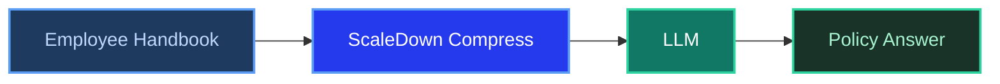

# RAG Example: HR Policy Bot

**ScaleDown Team** • February 2025 • 10 min read

Employees ask the same HR questions all the time: *"How many vacation days do I get?"*, *"What's the parental leave policy?"*, *"Can I work remotely from another country?"* An internal policy bot can answer these instantly from your employee handbook, and you don't need a vector database to build one.

Feed your company handbook as `context`, the employee's question as `prompt`, and ScaleDown compresses away every policy section except the one that matters.

<Tip>
This example builds an **internal HR policy bot** that answers employee questions from a company handbook using only ScaleDown and an LLM.
</Tip>

---

## The Problem

Employee handbooks are dense. A typical one covers PTO, benefits, remote work, expenses, conduct policies, and more. When someone asks about vacation days, they don't need to read the anti-bribery policy. ScaleDown strips the irrelevant sections automatically.



---

## The Employee Handbook

Here's a realistic company handbook covering 7 policy areas:

<Accordion title="Sample employee handbook">
```python
handbook = """
## Paid Time Off (PTO)
All full-time employees receive PTO based on tenure:
- 0-2 years: 15 days per year
- 3-5 years: 20 days per year
- 6+ years: 25 days per year
PTO accrues monthly and can be carried over up to 5 days into the next calendar year.
Unused PTO beyond the carryover limit is forfeited on January 1. PTO requests must
be submitted at least 2 weeks in advance for absences longer than 3 days. Manager
approval is required for all PTO. Part-time employees receive prorated PTO based
on their scheduled hours.

## Parental Leave
Primary caregivers receive 16 weeks of fully paid parental leave. Secondary
caregivers receive 6 weeks of fully paid leave. Leave must begin within 12 months
of the birth or adoption date. Employees may take leave in a single block or split
it into two blocks with manager approval. Health insurance coverage continues
during the entire leave period. Employees must have been with the company for at
least 6 months to be eligible.

## Remote Work Policy
Employees may work remotely up to 3 days per week with manager approval. Fully
remote arrangements require VP-level approval and are evaluated case by case.
All remote employees must maintain a dedicated workspace with reliable
internet (minimum 50 Mbps). Remote work from outside the employee's home country
requires prior approval from Legal and HR due to tax and employment law
implications. Requests must be submitted at least 30 days in advance and are
limited to 4 weeks per calendar year.

## Expense Reimbursement
Business expenses are reimbursed when submitted within 30 days of the expense.
Receipts are required for all expenses over $25. Pre-approval is required for:
- Travel expenses over $500
- Conference/event registration
- Equipment purchases over $200
Meals during business travel are reimbursed up to $75/day. Home office equipment
is covered up to $1,500 for new hires (one-time) and $500/year for existing
employees. Expense reports must be submitted through the Expensify app.

## Health Benefits
Full-time employees are eligible for health benefits starting the first day of
the month following their start date. We offer three plans:
- Basic: $0 employee premium, $2,000 deductible, 80/20 coinsurance
- Standard: $75/month premium, $1,000 deductible, 90/10 coinsurance
- Premium: $150/month premium, $500 deductible, 95/5 coinsurance
Dental and vision coverage is included in all plans. Dependents can be added at
enrollment or during qualifying life events. The annual open enrollment period
is in November.

## Code of Conduct
All employees are expected to maintain professional conduct. Harassment,
discrimination, and retaliation of any kind are strictly prohibited. Violations
should be reported to HR or through the anonymous ethics hotline. The company
maintains a zero-tolerance policy for workplace violence. Dress code is business
casual for in-office days and client meetings. Employees must disclose any
conflicts of interest to their manager and HR within 30 days of becoming aware.

## Learning & Development
Each employee receives a $3,000 annual learning budget for courses, certifications,
and conferences. Unused budget does not carry over. Requests must be submitted
through the L&D portal and approved by the employee's manager. The company also
offers internal mentorship programs, lunch-and-learn sessions, and access to
LinkedIn Learning. Tuition reimbursement for degree programs is available up to
$10,000/year for employees with 2+ years of tenure, subject to VP approval and
a 2-year commitment agreement.
"""
```
</Accordion>

---

## Build the HR Policy Bot

<Steps>
  <Step title="Set up your clients">
    ```python
    import requests
    from openai import OpenAI

    SCALEDOWN_URL = "https://api.scaledown.xyz/compress/raw/"
    SCALEDOWN_HEADERS = {
        "x-api-key": "YOUR_SCALEDOWN_API_KEY",
        "Content-Type": "application/json"
    }
    openai_client = OpenAI()
    ```
  </Step>

  <Step title="Compress the handbook against the question">
    An employee asks about working from abroad. The handbook has 7 sections. ScaleDown compresses it down to just the remote work policy.

    ```python
    employee_question = "Can I work remotely from Spain for 3 weeks? What do I need to do?"

    response = requests.post(
        SCALEDOWN_URL,
        headers=SCALEDOWN_HEADERS,
        json={
            "context": handbook,
            "prompt": employee_question,
            "model": "gpt-4o",
            "scaledown": {"rate": "auto"}
        }
    )

    result = response.json()
    compressed = result["compressed_prompt"]

    print(f"Original: {result['original_prompt_tokens']} tokens")
    print(f"Compressed: {result['compressed_prompt_tokens']} tokens")
    ```

    <Accordion title="What got compressed?">
    The handbook covers PTO, parental leave, remote work, expenses, health benefits, code of conduct, and L&D. The employee asked about **remote work from another country**.

    ScaleDown kept the remote work policy, specifically the international work clause (Legal/HR approval, 30-day advance notice, 4-week annual limit), and compressed away all other sections.
    </Accordion>
  </Step>

  <Step title="Generate the answer">
    ```python
    response = openai_client.chat.completions.create(
        model="gpt-4o",
        messages=[
            {
                "role": "system",
                "content": (
                    "You are an internal HR assistant. Answer the employee's "
                    "question using ONLY the provided handbook context. Be "
                    "specific about requirements, deadlines, and approval processes. "
                    "If the policy doesn't cover the question, say so."
                )
            },
            {
                "role": "user",
                "content": f"Handbook:\n{compressed}\n\nQuestion: {employee_question}"
            }
        ],
        temperature=0.2
    )

    print(response.choices[0].message.content)
    ```

    **Example output:**
    > Yes, you can work remotely from Spain for 3 weeks. This falls within the 4-week per calendar year limit for international remote work. Here's what you need to do:
    >
    > 1. Submit a request to both Legal and HR at least 30 days before your planned start date
    > 2. Get prior approval (this is required due to tax and employment law implications)
    >
    > Make sure to submit your request soon to meet the 30-day advance notice requirement.

    <Check>
    The answer correctly identifies the 4-week limit, the 30-day advance notice, and the Legal/HR approval requirement. All from the compressed handbook context.
    </Check>
  </Step>
</Steps>

---

## Reusable HR Bot Function

<Tabs>
  <Tab title="Python" icon="python">
    ```python
    def ask_hr(handbook_text: str, question: str) -> str:
        """Answer an employee's HR question from the handbook."""

        # Compress: keeps the relevant policy section
        compress_resp = requests.post(
            SCALEDOWN_URL,
            headers=SCALEDOWN_HEADERS,
            json={
                "context": handbook_text,
                "prompt": question,
                "model": "gpt-4o",
                "scaledown": {"rate": "auto"}
            }
        )
        compressed = compress_resp.json()["compressed_prompt"]

        # Generate
        ai_resp = openai_client.chat.completions.create(
            model="gpt-4o",
            messages=[
                {
                    "role": "system",
                    "content": (
                        "You are an internal HR assistant. Answer using ONLY "
                        "the provided handbook. Be specific about deadlines, "
                        "amounts, and approval requirements."
                    )
                },
                {
                    "role": "user",
                    "content": f"Handbook:\n{compressed}\n\nQuestion: {question}"
                }
            ],
            temperature=0.2
        )
        return ai_resp.choices[0].message.content


    # Example queries employees actually ask
    print(ask_hr(handbook, "How many vacation days do I get after 4 years?"))
    print(ask_hr(handbook, "I'm having a baby in March, what leave do I get as the primary caregiver?"))
    print(ask_hr(handbook, "What's the budget for buying a standing desk?"))
    print(ask_hr(handbook, "Which health plan has the lowest deductible?"))
    print(ask_hr(handbook, "Can I get reimbursed for an AWS certification course?"))
    ```
  </Tab>
</Tabs>

---

## Why This Works for HR

<CardGroup cols={2}>
  <Card title="Employees get instant answers" icon="clock">
    No waiting for HR to reply to a Slack message. The bot answers common policy questions in seconds, from the actual handbook.
  </Card>
  <Card title="Answers stay accurate" icon="shield-check">
    ScaleDown preserves the exact policy text, so the LLM quotes real numbers: $3,000 L&D budget, 16 weeks parental leave, $75/day meal cap. No guessing.
  </Card>
</CardGroup>

<Warning>
For sensitive topics like disciplinary actions, termination, or accommodation requests, always direct employees to speak with their HR representative directly.
</Warning>
