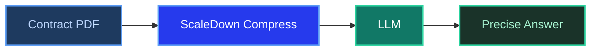

# RAG Example: Legal Contract Analyzer

**ScaleDown Team** • February 2025 • 10 min read

Legal teams spend hours reading through multi-page contracts to find specific clauses. A RAG-powered contract analyzer can answer questions like *"What's the termination clause?"* or *"What are our liability caps?"* in seconds. Traditionally you'd need a vector database to index every contract. With ScaleDown, you don't.

Feed the contract as `context`, ask your question as `prompt`, and ScaleDown compresses away the irrelevant sections before the LLM sees them.

<Tip>
This example builds a **contract Q&A tool** that answers clause-specific questions from legal agreements. No vector database, no embeddings.
</Tip>

---

## The Problem

Contracts are long, dense, and full of boilerplate. When a lawyer asks *"What's the liability cap?"*, the LLM doesn't need to read 15 pages of definitions, recitals, and signature blocks. It needs the one paragraph that matters.

ScaleDown's query-aware compression handles this well. It keeps the clauses relevant to the question and compresses everything else.



---

## The Contract

Here's a realistic software licensing agreement with multiple clauses:

<Accordion title="Sample contract text">
```python
contract = """
SOFTWARE LICENSE AGREEMENT

Effective Date: January 15, 2025
Parties: Acme Corp ("Licensor") and Beta Industries ("Licensee")

1. DEFINITIONS
"Software" means the Acme Analytics Platform v4.2 and all associated documentation.
"Licensed Users" means employees of Licensee authorized to access the Software,
not to exceed 500 users. "Confidential Information" means any non-public technical,
business, or financial information disclosed by either party.

2. GRANT OF LICENSE
Licensor grants Licensee a non-exclusive, non-transferable license to use the
Software for internal business purposes only. Licensee may not sublicense,
distribute, or make the Software available to any third party. The license
is valid for the Territory defined as the United States and Canada only.

3. FEES AND PAYMENT
Licensee shall pay an annual license fee of $240,000, due within 30 days of
each anniversary of the Effective Date. Late payments shall accrue interest
at 1.5% per month. Licensor reserves the right to suspend access if payment
is more than 60 days overdue.

4. TERM AND TERMINATION
This Agreement has an initial term of 3 years from the Effective Date, with
automatic renewal for successive 1-year periods unless either party provides
written notice of non-renewal at least 90 days prior to expiration. Either
party may terminate for cause if the other party materially breaches this
Agreement and fails to cure such breach within 30 days of written notice.
Upon termination, Licensee must destroy all copies of the Software and
certify destruction in writing within 14 days.

5. LIABILITY AND INDEMNIFICATION
Licensor's total aggregate liability under this Agreement shall not exceed
the fees paid by Licensee in the 12 months preceding the claim. In no event
shall either party be liable for indirect, incidental, special, or consequential
damages, including lost profits. Licensee shall indemnify Licensor against any
third-party claims arising from Licensee's use of the Software in violation
of this Agreement.

6. CONFIDENTIALITY
Each party agrees to maintain the confidentiality of the other party's
Confidential Information for a period of 5 years following disclosure.
Confidential Information does not include information that: (a) is or becomes
publicly available, (b) was known prior to disclosure, (c) is independently
developed, or (d) is disclosed pursuant to legal requirement.

7. DATA PROTECTION
Licensor shall implement and maintain industry-standard security measures,
including SOC 2 Type II compliance, AES-256 encryption at rest, and TLS 1.3
for data in transit. Licensor will notify Licensee of any data breach within
72 hours of discovery. Licensee retains ownership of all data processed
through the Software.

8. GOVERNING LAW AND DISPUTES
This Agreement shall be governed by the laws of the State of Delaware.
Any disputes shall be resolved through binding arbitration administered
by the American Arbitration Association in Wilmington, Delaware.
"""
```
</Accordion>

---

## Build the Contract Analyzer

<Steps>
  <Step title="Set up your clients">
    ```python
    import requests
    from openai import OpenAI

    SCALEDOWN_URL = "https://api.scaledown.xyz/compress/raw/"
    SCALEDOWN_HEADERS = {
        "x-api-key": "YOUR_SCALEDOWN_API_KEY",
        "Content-Type": "application/json"
    }
    openai_client = OpenAI()
    ```
  </Step>

  <Step title="Compress the contract against the question">
    The contract has 8 sections. The user only cares about one or two. ScaleDown figures out which.

    ```python
    question = "What is the liability cap and are there any exclusions?"

    # ScaleDown keeps liability-related clauses, compresses the rest
    response = requests.post(
        SCALEDOWN_URL,
        headers=SCALEDOWN_HEADERS,
        json={
            "context": contract,
            "prompt": question,
            "model": "gpt-4o",
            "scaledown": {"rate": "auto"}
        }
    )

    result = response.json()
    compressed = result["compressed_prompt"]

    print(f"Original: {result['original_prompt_tokens']} tokens")
    print(f"Compressed: {result['compressed_prompt_tokens']} tokens")
    # Original: 620 tokens
    # Compressed: 95 tokens
    ```

    <Info>
    The contract has 8 clauses totaling ~620 tokens. ScaleDown compressed it to ~95 tokens by keeping **Section 5 (Liability)** and dropping definitions, payment terms, confidentiality, and governing law, since none of those answer the question.
    </Info>
  </Step>

  <Step title="Get the answer from your LLM">
    ```python
    response = openai_client.chat.completions.create(
        model="gpt-4o",
        messages=[
            {
                "role": "system",
                "content": (
                    "You are a legal assistant. Answer the question using "
                    "ONLY the provided contract context. Cite specific "
                    "sections when possible. If the answer is not in the "
                    "context, say so."
                )
            },
            {
                "role": "user",
                "content": f"Contract context:\n{compressed}\n\nQuestion: {question}"
            }
        ],
        temperature=0.1
    )

    print(response.choices[0].message.content)
    ```

    **Example output:**
    > Per Section 5, the Licensor's total aggregate liability is capped at the fees paid by Licensee in the 12 months preceding the claim. Neither party is liable for indirect, incidental, special, or consequential damages, including lost profits.

    <Check>
    The answer cites the correct section, states the exact cap, and lists the exclusions. All from the compressed context.
    </Check>
  </Step>
</Steps>

---

## Reusable Contract Q&A Function

<Tabs>
  <Tab title="Python" icon="python">
    ```python
    def ask_contract(contract_text: str, question: str) -> str:
        """Query a legal contract using ScaleDown compression."""

        # Compress: keeps clauses relevant to the question
        compress_resp = requests.post(
            SCALEDOWN_URL,
            headers=SCALEDOWN_HEADERS,
            json={
                "context": contract_text,
                "prompt": question,
                "model": "gpt-4o",
                "scaledown": {"rate": "auto"}
            }
        )
        compressed = compress_resp.json()["compressed_prompt"]

        # Generate: LLM answers from compressed context
        ai_resp = openai_client.chat.completions.create(
            model="gpt-4o",
            messages=[
                {
                    "role": "system",
                    "content": (
                        "You are a legal assistant. Answer using ONLY the "
                        "provided contract context. Cite sections when possible."
                    )
                },
                {
                    "role": "user",
                    "content": f"Contract:\n{compressed}\n\nQuestion: {question}"
                }
            ],
            temperature=0.1
        )
        return ai_resp.choices[0].message.content


    # Example queries
    print(ask_contract(contract, "Can we sublicense the software to partners?"))
    print(ask_contract(contract, "What happens if we pay late?"))
    print(ask_contract(contract, "How much notice do we need to cancel?"))
    print(ask_contract(contract, "What security standards does the vendor meet?"))
    ```
  </Tab>
</Tabs>

---

## Why This Works for Legal

<CardGroup cols={2}>
  <Card title="Precision matters" icon="bullseye-arrow">
    Legal answers need to cite specific clauses. By compressing away irrelevant sections, the LLM focuses on the right text, which means fewer hallucinated clause references.
  </Card>
  <Card title="Contracts are long" icon="file-lines">
    A typical enterprise contract is 10-30 pages. Compression cuts token costs by 70-85% per query while keeping the clauses that matter.
  </Card>
</CardGroup>

<Warning>
This tool is for informational purposes. Always have a qualified attorney review contract interpretations before making legal decisions.
</Warning>
